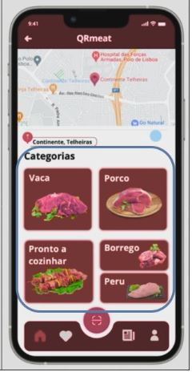

<table>
  <tr>
    <th>Views</th>
    <th>Components</th>
    <th>ViewModels</th>
  </tr>
  <tr>
    <td rowspan="2"></td>
    <td >Popup</td>
    <td >props.header  => popupFeedbackText 
      props.HandleClick  => selectEvaluation
    </td>
  </tr>
  <tr>
    <td rowspan="1"> Buttons </td>
    <td >props.handleClick  => cancelFeedback
      props.HandleClick  => giveFeedback
    </td>
  </tr>
  <tr>
    <td rowspan="2"></td>
    <td >Classifications</td>
    <td> props.header  => HeaderText 
      props.evaluations  => userEvaluation 
      props.footer  => FooterText 
    </td>
  </tr>
  <tr>
    <td rowspan="1"> Button 
    <td >props.handleClick  => feedbackPopup</td>
  </tr>
  
 
  
</table>
