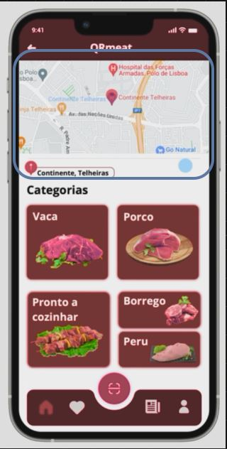

<table>
  <tr>
    <th>Views</th>
    <th>Components</th>
    <th>ViewModels</th>
  </tr>
  <tr>
    <td rowspan="2"></td>
    <td >Header</td>
    <td >props.googleMap  => currentLocMap 
  </tr>
  <tr>
    <td rowspan="1"> Text 
    <td >props.handleClick  => googlemaps</td>
  </tr>
  
 
  
</table>
