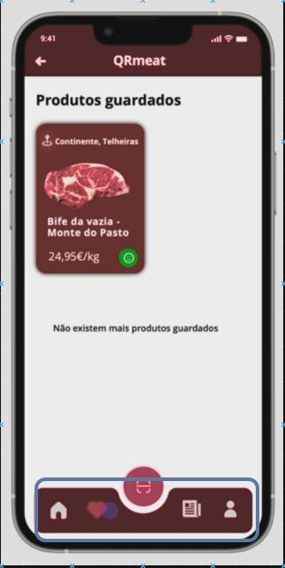

<table>
  <tr>
    <th>Views</th>
    <th>Components</th>
    <th>ViewModels</th>
  </tr>
  <tr>
    <td rowspan="5"></td>
    <tr>
    <td rowspan="4">MenuButtons</td>
    <td >props.handleClick => homeMenu</td>
  </tr>
  <tr>
    <td >props.handleClick => SavedProdMenu</td>
  </tr>
  <tr>
    <td >props.handleClick => NewsMenu</td>
  </tr>
  <tr>
    <td >props.handleClick => AccountMenu</td>
  </tr>
  </tr>
  
  
 
  
</table>
