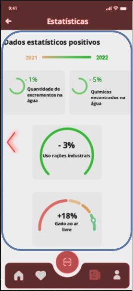
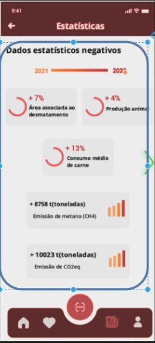

<table>
  <tr>
    <th>Views</th>
    <th>Components</th>
    <th>ViewModels</th>
  </tr>
  <tr>
    <td rowspan="2"></td>
    <td >Header</td>
    <td >props.header  => positiveStatsHeader</td>
  </tr>
  <tr>
    <td rowspan="1"> Statistics </td>
    <td > [0...*] props.statsGraphs  => postiveStats 
    </td>
  </tr>
  <tr>
    <td rowspan="3"></td>
    <td >HeaderNew</td>
    <td> props.header  => HeaderImageNews</td>
  </tr>
  <tr>
    <td rowspan="1"> NewsDescription 
    <td >props.title  => NewsTitle
     props.description  => NewsDescription
     props.handleClick  => detailedNews</td>
  </tr>
  <tr>
    <td rowspan="1"> NewsList 
    <td >props.newsImg  => NewsImageSmall
     props.title  => NewsTitleSmall
     props.description  => NewsDescriptionSmall</td>
  </tr>
  <tr>
    <td rowspan="2"></td>
    <td >Header</td>
    <td >props.header  => negativeStatsHeader</td>
    </tr>
    <tr>
    <td rowspan="1"> Statistics </td>
    <td>[0...*] props.statsGraphsNeg  => negativeStats
    </td>
  </tr>
  
 
  
</table>
