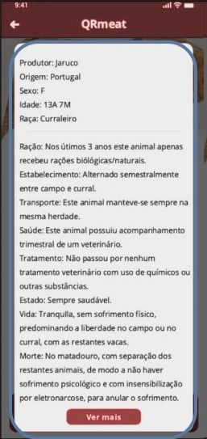

<table>
<tr>
<th>Views</th>
<th>Components</th>
<th>ViewModels</th>
</tr>
<tr>
<td rowspan="12"></td>
<tr>
<td>DestaqueDisplay</td>
<td>props.label =>  prodType</td>
</tr>
<tr>
<td rowspan = "5">Product</td>
<td>props.location =>  locationProd</td>
</tr>
<tr>
<td>props.img => prodImg</td>
</tr>
<tr>
<td>props.name =>  prodName</td>
</tr>
<tr>
<td>props.price =>  prodPrice</td>
</tr>
<tr>
<td>props.evaluation =>  prodFeedback</td>
</tr>
<tr>
<td>ProductLocation</td>
</tr>
<tr>
<td>ProductImage</td>
</tr>
<tr>
<td>ProductName</td>
</tr>
<tr>
<td>ProductPrice</td>
</tr>
<tr>
<td>Feedback</td>
</tr>

</tr>

<tr>
<td rowspan = "6"></td>
<tr>
<td>Header</td>
<td>props.image =>  prodImage   props.name =>  prodName   props.price =>   prodPrice</td>

<tr>
</tr>
<tr>
<td>Details</td>
<td> props.animal => prodAnimalDetails</td>
</tr>
<tr>
<td>Expand</td>
<td>props.expand =>  handleExpandClick</td>
</tr>
<tr>
<td>Feedback</td>
<td>props.feedback =>  handleFeedbackClick</td>
</tr>

<tr>
<td rowspan="12"></td>
<tr>
<td>SavedDisplay</td>
<td>props.label =>  prodType</td>
</tr>
<tr>
<td rowspan = "5">Product</td>
<td>props.location =>  locationProd</td>
</tr>
<tr>
<td>props.img => prodImg</td>
</tr>
<tr>
<td>props.name =>  prodName</td>
</tr>
<tr>
<td>props.price =>  prodPrice</td>
</tr>
<tr>
<td>props.evaluation =>  prodFeedback</td>
</tr>
<tr>
<td>ProductLocation</td>
</tr>
<tr>
<td>ProductImage</td>
</tr>
<tr>
<td>ProductName</td>
</tr>
<tr>
<td>ProductPrice</td>
</tr>
<tr>
<td>Feedback</td>
</tr>

<tr>
<td rowspan ="3"></td>
<td>Header</td>
<td>props.location => prodLocation   props.meatType => prodType   props.header => headerType</td>
</tr>

<tr>
<td>SlideShow</td>
<td>props.desc => prodNameNational   props.img => prodImg   props.details => handlleDetailsClick   props.next => handleNextClick</td>
</tr>
<tr>
<td>ProductList</td>
<td>props.img => prodImg   props.name => prodName   props.price => prodPrice </td>
</tr>

<tr>
<td rowspan ="9"></td>
<td rowspan = "3">Header</td>
<td>props.producer =>  prodProducerName</td>
</tr>
<tr>
<td>props.origin => prodOrigin</td>
</tr>
<tr>
<td>props.animal =>  prodAnimalInfo</td>
</tr>
</tr>
<tr>
<td>Description</td>
<td>props.description =>  prodDescription</td>
</tr>
<tr>

</tr>
<tr>

</tr>
</tr>
<tr>
<td>Ver mais</td>
<td>props.watchMore =>  handleWatchMoreClick</td>
</tr>
<tr>

</tr>
<tr>

</tr>
</tr>
<tr>
<td rowspan ="5"></td>
<td rowspan ="5">StatisticsTable</td>
<td>props.weightInfo =>  prodWeight</td>
</tr>
<tr>
<td>props.carcassInfo => prodCarcass</td>
</tr>
<tr>
<td>props.finance =>  prodProfits</td>
</tr>

</table>

