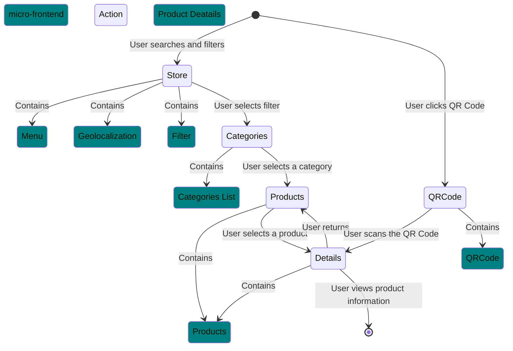

```mermaid
stateDiagram-v2
    classDef coloring fill:teal 

    state "micro-frontend" as LegendView

    state "Action" as ActionView

    state "Menu" as MenuView
    state "Geolocalization" as GeolocalizationView
    state "Filter" as FilterView
    state "QRCode" as QRCodeView
    state "Categories List" as CategoriesView   
    state "Products" as ProductsView
    state "Product Deatails" as DetailsView
    

    [*] --> Store: User searches and filters
    Store --> MenuView: Contains
    Store --> GeolocalizationView: Contains
    Store --> FilterView: Contains
    Store --> Categories: User selects filter
    Categories --> CategoriesView: Contains
    Categories --> Products: User selects a category
    Products --> ProductsView: Contains
    Products --> Details: User selects a product
    Details --> Products: User returns 
    [*] --> QRCode: User clicks QR Code
    QRCode --> Details: User scans the QR Code
    QRCode --> QRCodeView: Contains
    Details --> ProductsView: Contains
    Details --> [*]: User views product information


    Class QRCodeView, ProductsView, CategoriesView, StartView, DetailsView, LegendView, FilterView, GeolocalizationView, MenuView coloring

```
