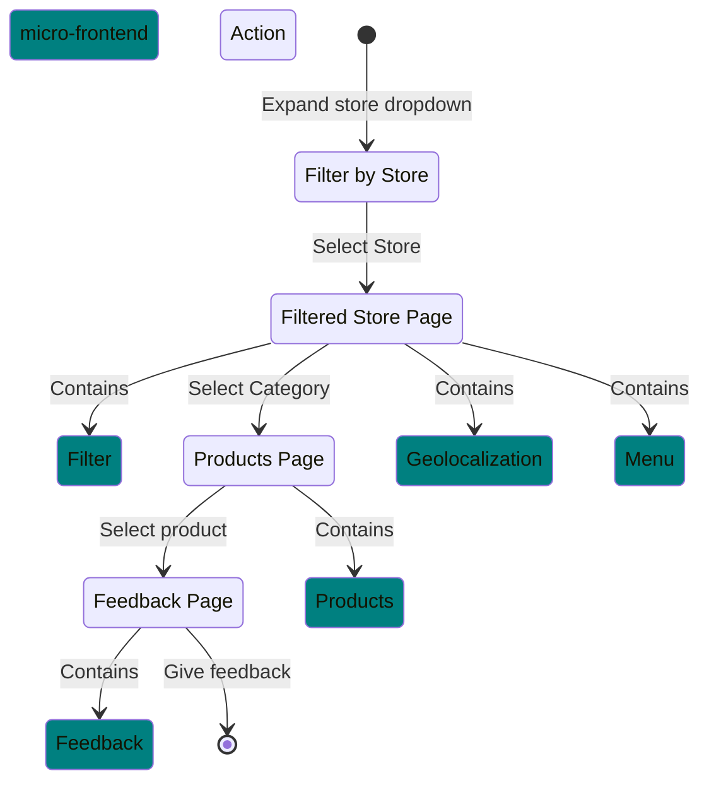

```mermaid
stateDiagram-v2
    classDef coloring fill:teal  

    state "micro-frontend" as LegendView

    state "Action" as ActionView

    state "Filter" as FilterView
    state "Filter by Store" as Filter
    state "Filtered Store Page" as FilteredPage
    state "Products Page" as ProductsPage
    state "Feedback Page" as FeedbackPage

    [*] --> Filter: Expand store dropdown
    FilteredPage --> Geolocalization: Contains
    FilteredPage --> FilterView: Contains
    FilteredPage --> Menu: Contains
    Filter --> FilteredPage: Select Store
    FilteredPage --> ProductsPage: Select Category
    ProductsPage --> Products: Contains
    FeedbackPage --> Feedback: Contains
    ProductsPage --> FeedbackPage: Select product 
    FeedbackPage --> [*]: Give feedback

    class Geolocalization, Menu, Products, Feedback, LegendView, FilterView coloring
```
