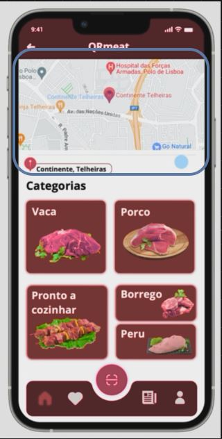

# Geolocalization system

The Geolocalization system will have features such as:

### Displaying selected points of sale location
Display currently selected supermarkets location in a half screen google maps window

The Geolocalization system should be a micro-frontend due to it's simplicity, this micro-frontend will only display the GPS location of the selected points of sale using google maps, reusability, if this system is required in more parts of the app it can be easily replicated there and flexibility, if more features are to be added to this micro-frontend that can be done without impacting other teams and micro-frontends.

