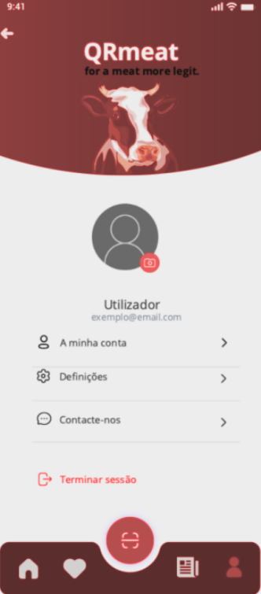
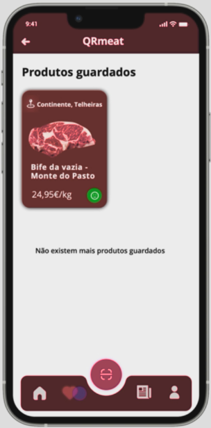

<table>
  <tr>
    <th>Views</th>
    <th>Components</th>
    <th>ViewModels</th>
  </tr>
  <tr>
    <td rowspan="5"></td>
    <td >HeaderImage</td>
    <td >props.imgSrc  => headerImgSrc 
  </tr>
  <tr>
    <td rowspan="2"> Text   Email   Email input   Password   Password Input</td>
    <td >props.property  => email  => password</td>
  </tr>
  <tr>
    <td>props.credentials  => SetEmail  => SetPassword</td>
    
  </tr>
  <tr>
    <td rowspan="2">Login</td>
    <td >props.label  => Login </td>
  </tr>
  <tr>
    <td >props.handleClick  => handleLogin </td>
  </tr>
  <tr>
    <td rowspan="8"></td>
    <td >HeaderImage</td>
    <td >props.imgSrc  => headerImgSrc 
</tr>
<tr>
    <td>userAvatar</td>
    <td >props.imgSrc => userImgURI</td>
  </tr>

  <tr>
    <td rowspan="2">userInfo</td>
    <td >props.name => userName</td>
  </tr>
  <tr>
    <td >props.email => userEmail</td>
  </tr>
  <tr>
    <td rowspan="3">accountManagagementButtons</td>
    <td >props.text => text</td>
  </tr>
  <tr>
    <td >props.image => imgSource</td>
  </tr>
  <tr>
    <td >props.handleClick => handleClick</td>
  </tr>
  <tr>
    <td>Logout</td>
    <td >props.handleClick => handleLogoutClick</td>
  </tr>
  <tr>
    <td rowspan="3"></td>
    <td>Saved Products</td>
    <td >ViewModelRow</td>
  </tr>
</table>
