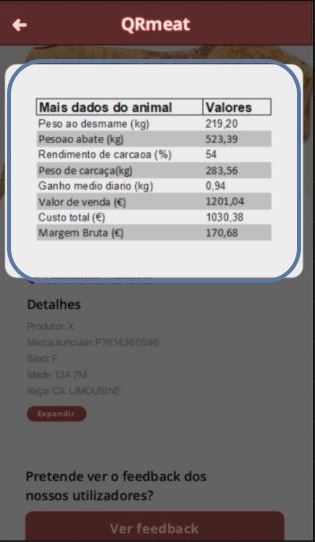

<table>
  <tr>
    <th>Views</th>
    <th>Components</th>
    <th>ViewModels</th>
  </tr>
  <tr>
    <td rowspan="11"></td>
    <tr>
    <td>DestaqueDisplay</td>
    <td>props.label =>  prodType</td>
    </tr>
    <tr>
    <td rowspan = "4">Product</td>
    <td>props.container =>   containerType</td>
    </tr>
    <tr>
    <td>props.container =>   containerType</td>
    </tr>
    <tr>
    <td>props.container =>   containerType</td>
    </tr>
    <tr>
    <td>props.container =>   containerType</td>
    </tr>
    <tr>
    <td>ProductLocation</td>
    </tr>
    <tr>
    <td>ProductImage</td>
    </tr>
    <tr>
    <td>ProductName</td>
    </tr>
    <tr>
    <td>ProductPrice</td>
    </tr>
    <tr>
    <td>Feedback</td>
    </tr>
    
    
    
  </tr>
  <tr>
    
  </tr>
  <tr>
    <td rowspan = "4"></td>
    <td>Header</td>
  </tr>
  <tr>
    <td>Details</td>
    </tr>
    <tr>
    <td>Expand</td>
    </tr>
    <tr>
    <td>Feedback</td>
    </tr>
    
  <tr>
    <td rowspan="8"></td>
    
  </tr>
  
  <tr>
    <td>DestaqueDisplay</td>
    </tr>
    <tr>
    <td>Product</td>
    </tr>
    <tr>
    <td>ProductLocation</td>
    </tr>
    <tr>
    <td>ProductImage</td>
    </tr>
    <tr>
    <td>ProductName</td>
    </tr>
    <tr>
    <td>ProductPrice</td>
    </tr>
    <tr>
    <td>Feedback</td>
    </tr>
  <tr>
    <td rowspan ="3"></td>
    <td>Header</td>
  </tr>

  <tr>
    <td>SlideShow</td>
    </tr>
    <tr>
    <td>ProductList</td>
    </tr>
    

  <tr>
    <td rowspan ="3"></td>
    <td>Header</td>
  </tr>
  <tr>
    <td>Description</td>
    </tr>
    <tr>
    <td>Ver mais</td>
    </tr>
  <tr>
    <td></td>
    <td>StatisticsTable</td>
  </tr>
  

  
</table>
