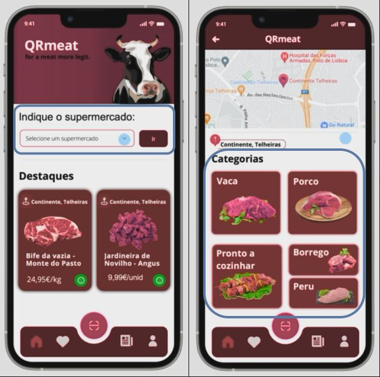

# Filter system
The Filter system will have features such as:
### Dropdown Search bar
This search bar onclick will display the supermarkets available for choice in the app
### Product filtering
After selecting the point of sale, the user should be able to select a category of meat.

The filter system should be a micro-frontend due to its simplicity, it's a system simply focused on filtering products according to their point of sale, reusability, incase the need to have the filtering system in other instances of the app arises, this system can be easily implemented if made as a micro-frontend, single responsability, the filtering system will have a just one responsability and that is filtering.

