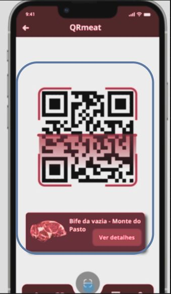

# QR code system
The QR code system will have features such as:
### Qr code reading
Detect meat products trough QR code.

The QR code system should be a micro-frontend system due to it's reusability, if needed we can implement QR code scanning easily in other parts of the app, single responsability, this micro-frontend system will have the single responsability of scanning QR codes and  team autonomy, the team responsible by this micro-frontend system will not have any dependences from the rest of the team developing the app.

