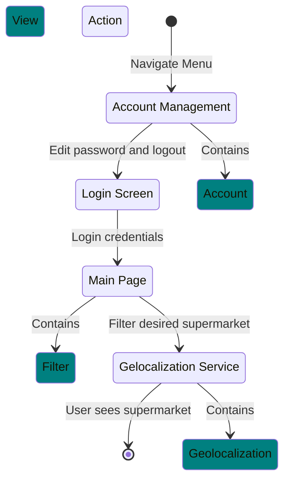

```mermaid
stateDiagram-v2

    classDef coloring fill:teal

    state "View" as LegendView
    state "Action" as ActionView

    state "Filter" as FilterView
    state "Main Page" as MainPage 
    state "Login Screen" as LoginScreen
    state "Account Management" as AccountManagement
    state "Gelocalization Service" as GelocalizationService

    [*] --> AccountManagement: Navigate Menu
    AccountManagement --> LoginScreen: Edit password and logout
    AccountManagement --> Account: Contains
    LoginScreen --> MainPage: Login credentials
    MainPage --> GelocalizationService: Filter desired supermarket
    MainPage --> FilterView: Contains
    GelocalizationService --> [*]: User sees supermarket
    GelocalizationService --> Geolocalization: Contains

    Class Geolocalization, Account, LegendView, FilterView coloring
```
