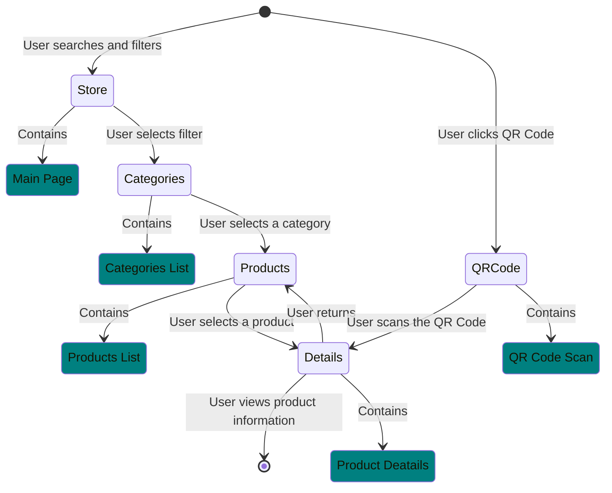

```mermaid
stateDiagram-v2
    classDef coloring fill:teal 

    state "Main Page" as StartView
    state "QR Code Scan" as QRCodeView
    state "Categories List" as CategoriesView   
    state "Products List" as ProductsView
    state "Product Deatails" as DetailsView
    

    [*] --> Store: User searches and filters
    Store --> StartView: Contains
    Store --> Categories: User selects filter
    Categories --> CategoriesView: Contains
    Categories --> Products: User selects a category
    Products --> ProductsView: Contains
    Products --> Details: User selects a product
    Details --> Products: User returns 
    [*] --> QRCode: User clicks QR Code
    QRCode --> Details: User scans the QR Code
    QRCode --> QRCodeView: Contains
    Details --> [*]: User views product information
    Details --> DetailsView: Contains


    Class QRCodeView, ProductsView, CategoriesView, StartView, DetailsView coloring

```
