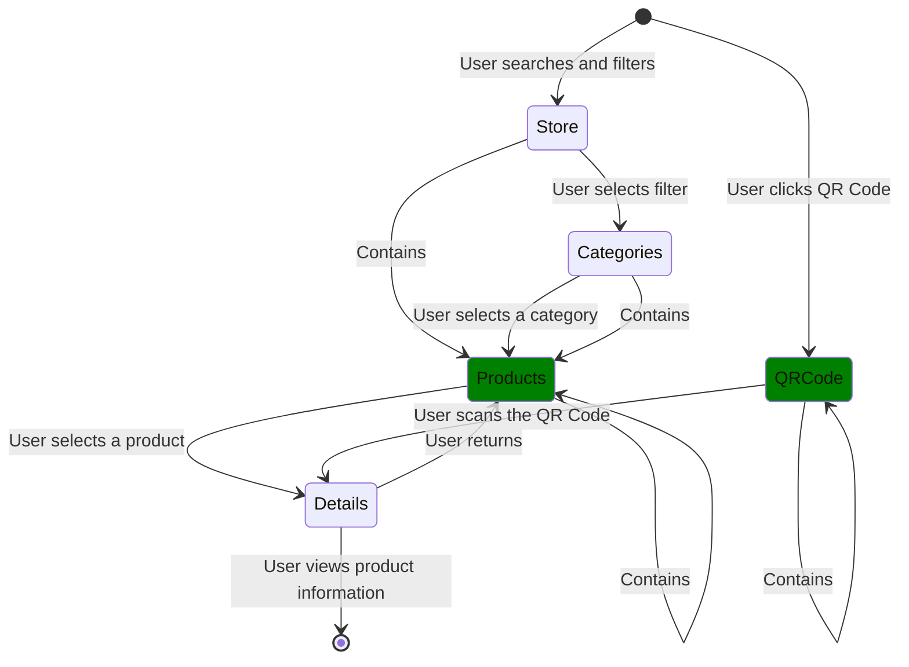

```mermaid
stateDiagram-v2
classDef coloring fill:green 
    [*] --> Store: User searches and filters
    Store --> Categories: User selects filter
    Store --> Products: Contains
    Categories --> Products: User selects a category
    Categories --> Products: Contains
    Products --> Details: User selects a product
    Products --> Products: Contains
    Details --> Products: User returns 
    [*] --> QRCode: User clicks QR Code
    QRCode --> Details: User scans the QR Code
    QRCode --> QRCode: Contains
    Details --> [*]: User views product information

    Class QRCode, Products coloring

```
