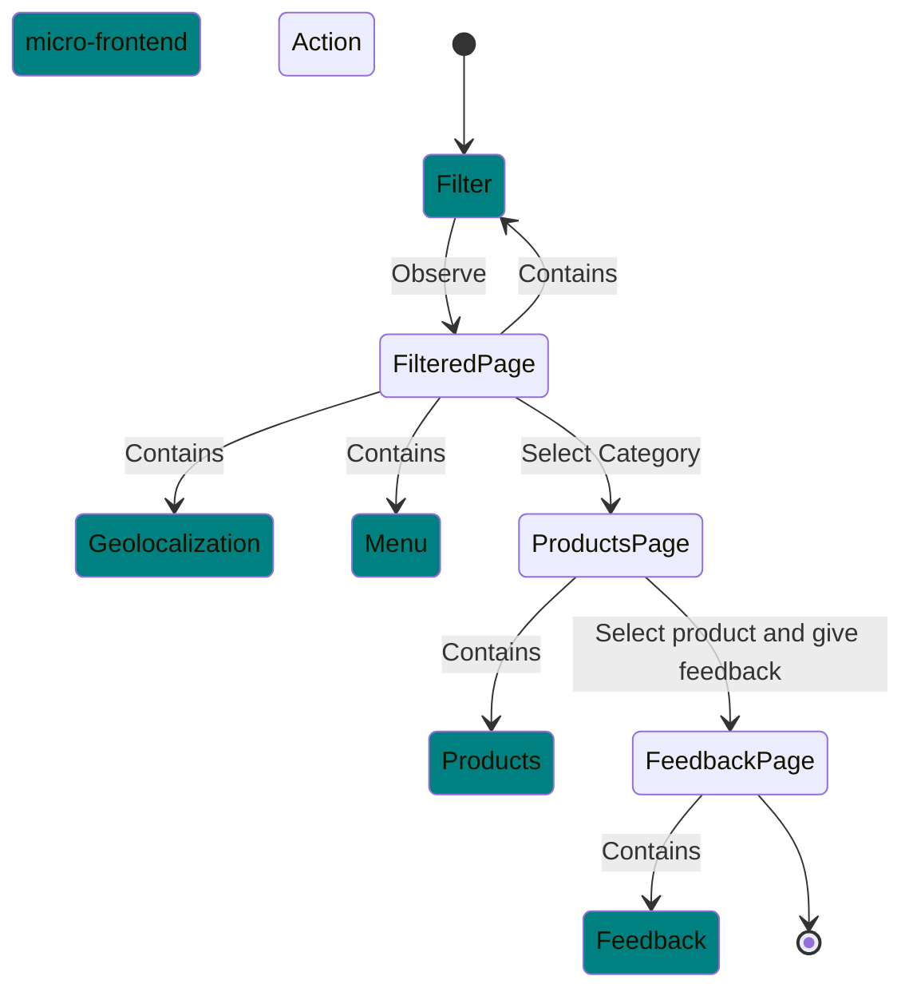

```mermaid
stateDiagram-v2
    classDef coloring fill:teal  

    state "micro-frontend" as LegendView

    state "Action" as ActionView

    [*] --> Filter
    FilteredPage --> Geolocalization: Contains
    FilteredPage --> Filter: Contains
    FilteredPage --> Menu: Contains
    Filter --> FilteredPage: Observe
    FilteredPage --> ProductsPage: Select Category
    ProductsPage --> Products: Contains
    FeedbackPage --> Feedback: Contains
    ProductsPage --> FeedbackPage: Select product and give feedback
    FeedbackPage --> [*]

    class Geolocalization, Menu, Products, Feedback, Filter, LegendView coloring
```
