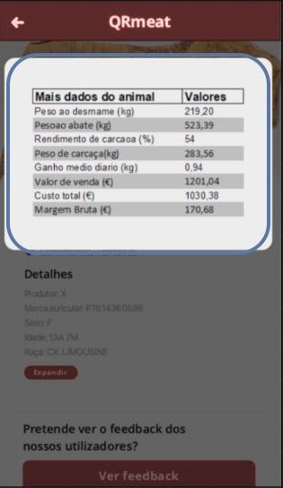

<table>
  <tr>
    <th>Micro-frontends</th>
    <th>Views</th>
    <th>FE services</th>
  </tr>
  <tr>
    <td rowspan="7">Product Display</td>
    <td rowspan="2"></td>
    <td >S1</td>
  </tr>
  <tr>
    <td>S2</td>
  </tr>
  <tr>
    <td></td>
    <td>S1</td>
  </tr>
  <tr>
    <td></td>
    <td>S1</td>
  </tr>
  <tr>
    <td></td>
    <td>S1</td>
  </tr>
  <tr>
    <td></td>
    <td>S1</td>
  </tr>
  <tr>
    <td></td>
    <td>S1</td>
  </tr>

  
</table>