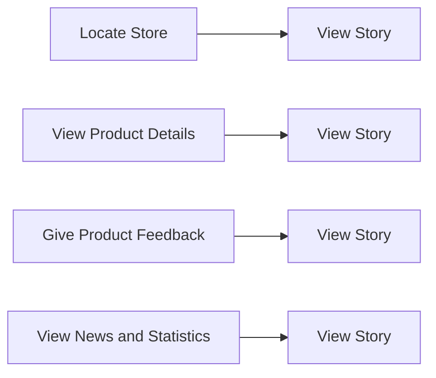

```mermaid
flowchart LR
    A[Locate Store] --> B[View Story]
    C[View Product Details] --> D[View Story]
    E[Give Product Feedback] --> F[View Story]
    G[View News and Statistics] --> H[View Story]

    click A href "https://github.com/0xjrr/aw-project/blob/main/front-end/stories/story-acc-geo.md" "Locate Store Story"
    click C href "front-end/stories/story-details.md" "View Product Details Story"
    click E href "front-end/stories/story-feedback.md" "Give Product Feedback Story"
    click G href "front-end/stories/story-news.md" "View News and Statistics Story"

```
